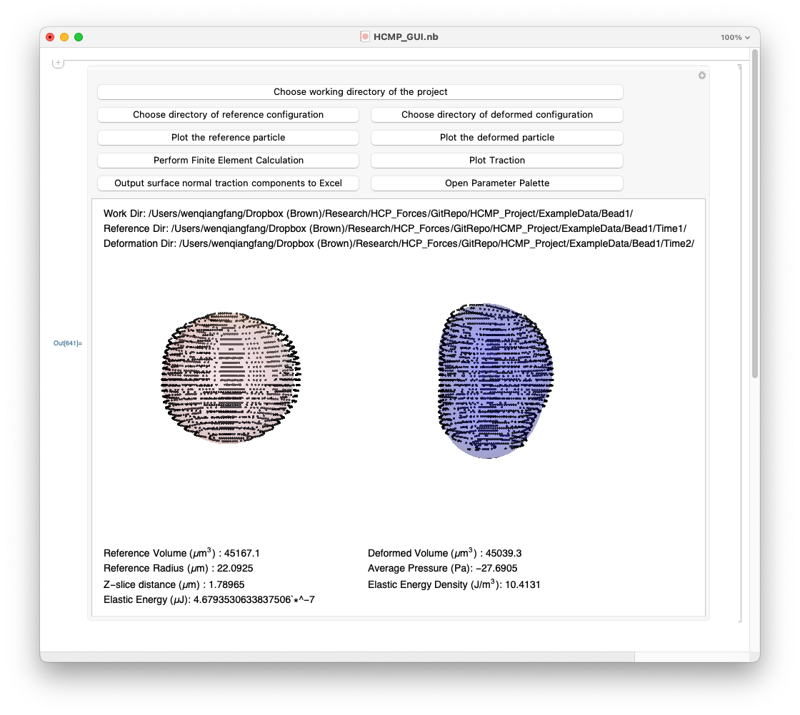
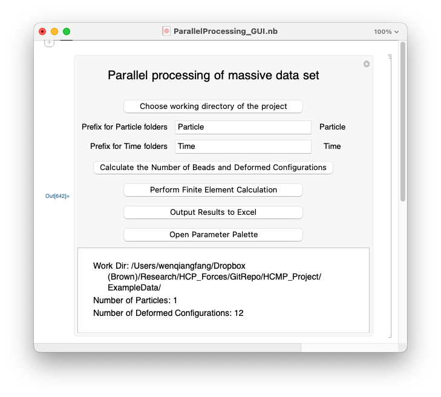
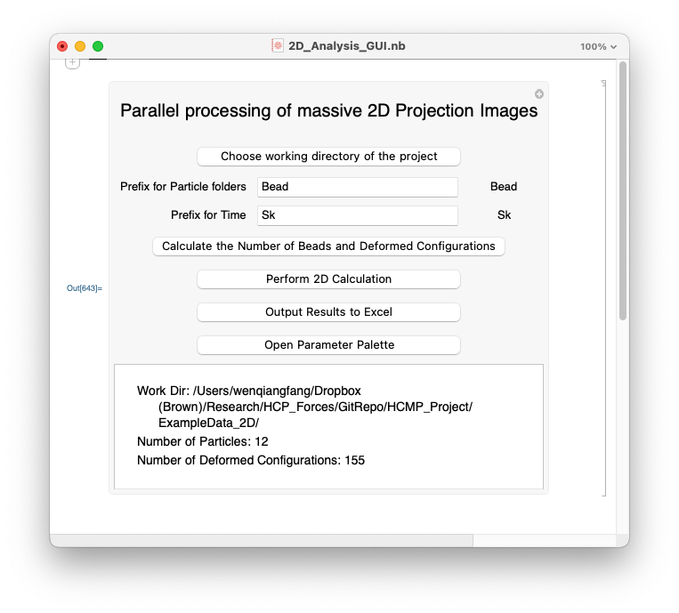
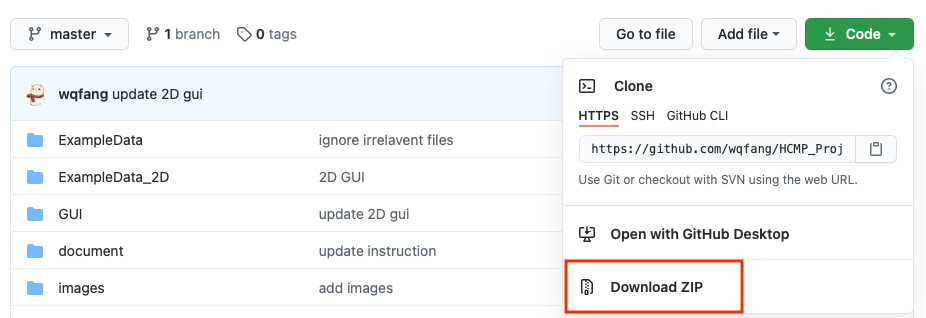
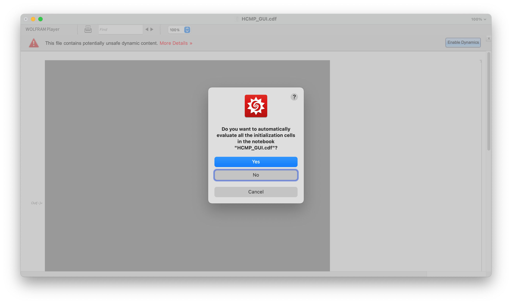
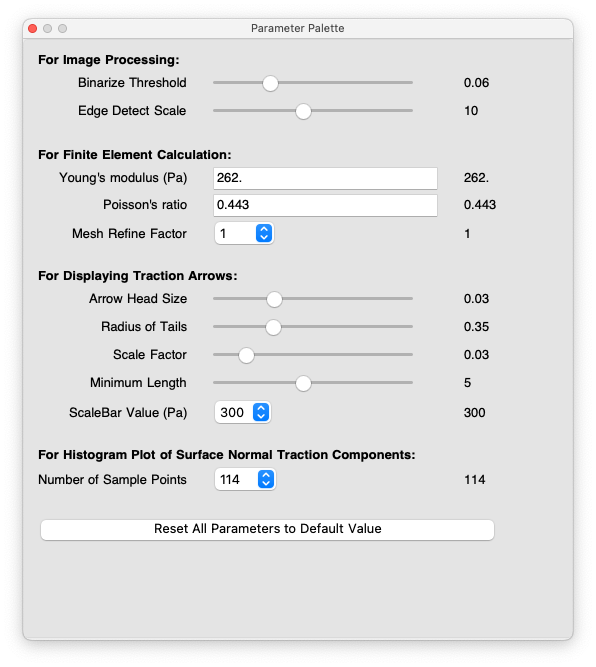
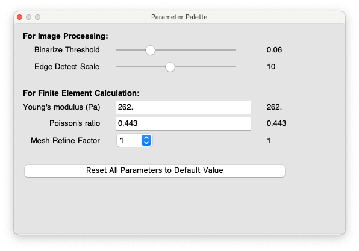
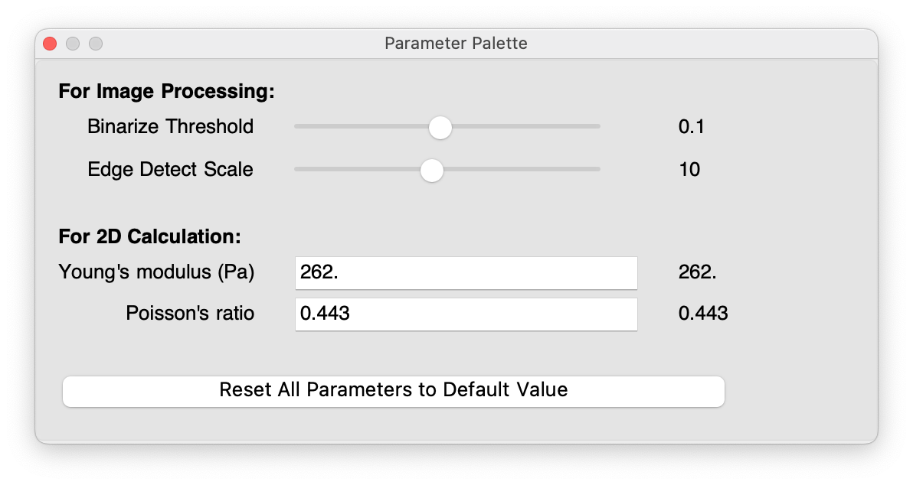
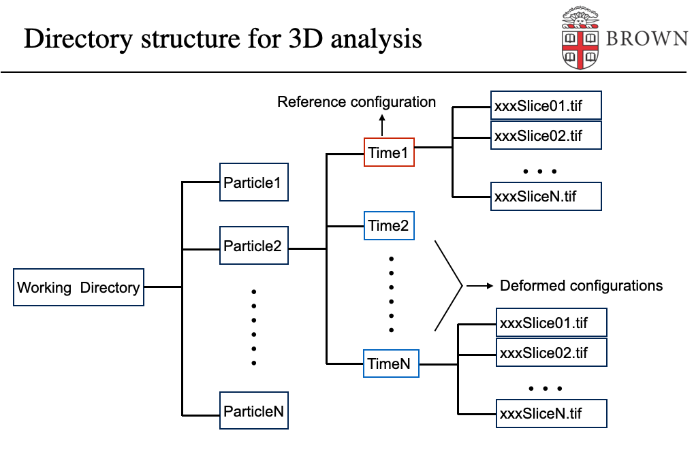
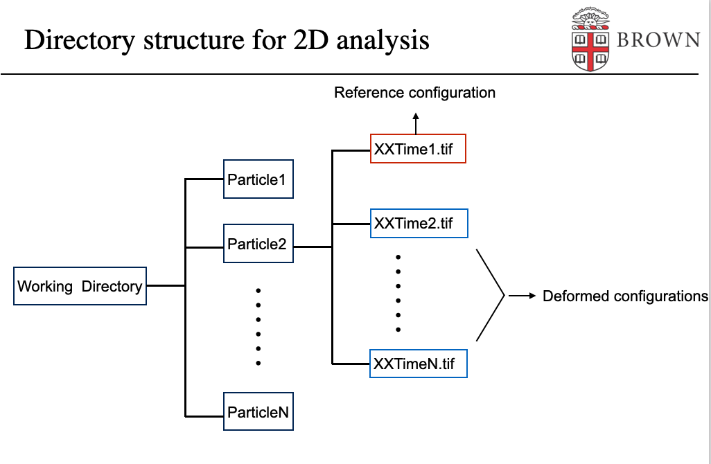

# HCMP Project GUIs

<!-- TABLE OF CONTENTS -->

  
Table of Contents

  <ol>
    <li>
      <a href="#introduction">Introduction</a>
    </li>
    <ul>
      <li><a href="#hcmp_gui">HCMP_GUI</a></li>
      <li><a href="#parallelprocessing_gui">ParallelProcessing_GUI</a></li>
      <li><a href="#2d_analysis_gui">2D_Analysis_GUI</a></li>
    </ul>
    <li>
      <a href="#getting-started">Getting Started</a>
      <ul>
        <li><a href="#download-and-install-wolfram-player">Download and Install Wolfram Player</a></li>
        <li><a href="#download-the-guis">Download the GUIs</a></li>
        <li><a href="#quick-demonstration">Quick Demonstration</a></li>
      </ul>
    </li>
    <li>
      <a href="#requirement-on-working-directory-structure-and-filedirectory-names">Requirement on working directory structure and file/directory names</a>
    </li>
    <li><a href="#license">License</a></li>
    <li><a href="#contact">Contact</a></li>
    <li><a href="#reference">Reference</a></li>
  </ol>

## Introduction
This repository provide the **Graphic User Interfaces (GUIs)** for the **hyper-compliant microparticles (HCMPs)** Project.

In the `GUI` folder, we provide three Wolfram Computable Document Format (**CDF**) files
- __HCMP_GUI.cdf__ : the GUI for processing single particle deformation using 3D finite element analysis (FEA) and visualizing 3D shape/surface traction vector plot/surface normal traction histogram.
- __ParallelProcessing_GUI.cdf__: the GUI for processing massive data in parallel using 3D FEA.
- __2D_Analysis_GUI.cdf__: the GUI for processing massive data in parallel using spherically symmetric continuum mechanics approximation.

### HCMP_GUI

__HCMP_GUI.cdf__ works on one pair of HCMP configurations. It will plot the point cloud and fitting surface of both one non-deformed HCMP and one deformed HCMP. By using the linear theory of elasticity, the HCMP's stress field is determined through finite element analysis.
It will plot the traction vectors on the deformed configuration of the HCMP's surface. The normal component of the traction vector (normal traction component) at a large number of HCMP surface points are recorded. The distributions of the normal traction component data will be shown as colormap on the deformed configuration of the HCMP's surface as well as a histogram plot. Radius, volume, average pressures (one third the trace of the stress tensor), elastic energy density and total elastic energy stored within the HCMP will be calculated.

### ParallelProcessing_GUI

__ParallelProcessing_GUI.cdf__ works for processing massive data set. It performs all image processing and finite element calculations in parallel in one click. In order to use it, you need to put your images in a specific directory structure and rename all file and directory names following the given patterns (see <a href="#requirement-on-working-directory-structure-and-filedirectory-names">Requirement on working directory structure and file/directory names</a>).

### 2D_Analysis_GUI

__2D_Analysis_GUI.cdf__ works for processing massive 2D Projection image data set. It performs all image processing and 2D calculations in parallel in one click. The 2D calculations are performed by assuming that the deformed particle is spherically symmetric so that analytical solutions are available through continuum mechanics analysis.

In order to use the CDF file, you need to put your images in a specific directory structure and rename all file and directory names following the given patterns (see <a href="#requirement-on-working-directory-structure-and-filedirectory-names">Requirement on working directory structure and file/directory names</a>).

## Getting Started
It is easy to run the GUIs on your own by following the instructions:

### Download and Install Wolfram Player
In order to open the HCMP GUIs in the main file `HCMP_GUI.cdf`, `ParallelProcessing_GUI.cdf`, and `2D_Analysis_GUI.cdf`, you need to install [Wolfram Player](https://www.wolfram.com/player/) on your computer. [Wolfram Player](https://www.wolfram.com/player/) is a free software developed by [Wolfram Reserch](https://en.wikipedia.org/wiki/Wolfram_Research). The player is available for Microsoft Windows, Macintosh, Linux and iOS, and can be downloaded from the following website:

https://www.wolfram.com/player

Taking **MacOS** for example, after you open the downloaded `WolframPlayer_12.1.1_MAC_DLM` file, you should be able to see

After it is finished, you need to launch the installation package and it will show

When this is done, you can drag the Wolfram Player icon to the `Applications` folder to complete installation.

### Download the GUIs

On the top-right corner of this page, you will see a green button **⤓ Code**. Clicking on it, you will find the option to **Download ZIP** of the whole project.

You need to unzip the file. Inside the resulted folder, you will find the main file `HCMP_GUI.cdf`, `ParallelProcessing_GUI.cdf`, and `2D_Analysis_GUI.cdf` in folder `GUI`, open it with [Wolfram Player](https://www.wolfram.com/player/). Upon opening any of the files, you may see a pop-up window as shown in the following screenshot. Click on **Yes**.

After you have done all the above steps correctly, A user-interface will show up in the opened file as the screenshots shown in <a href="#introduction">Introduction</a>.

### Quick Demonstration

#### HCMP_GUI

After the GUI is opened, you need to click on the buttons in sequence from top to bottom, from left to right.

For example, you can choose the folder `ExampleData` as the working directory of the project, choose `ExampleData/Bead1/Time1` and `ExampleData/Bead1/Time2` as the directory of reference configuration and deformed configuration, respectively. Then yo will need to click on buttons `Plot the reference particle` and `Plot the deformed particle` to visualize the constructed 3D shapes.

In the next step, clicking on buttons `Perform Finite Element Calculation`, the program will be running in the background and showing a dialog `Finite Element Calculation is done.` when the calculation is finished. The button `Plot Traction` allows for the visualization of traction plot over the particle's surface, while button `Output surface normal traction components to Excel` allows you to save the traction components into an Excel file.

Finally, in case the default settings do not give you great result or you are using particles with different mechanical properties, try to tune the parameters in Parameter Palette, which can be opened by clicking on button `Open Parameter Palette`. The Parameter Palette is shown as

The change of any parameter won't be effective immediately. You have to re-run the commands in the main GUI to visualize the changes in the output result.

#### ParallelProcessing_GUI

After the GUI is opened, you need to click on the buttons in sequence from top to bottom.

For example, you can choose the folder `ExampleData` as the working directory of the project. If inputing keywords "Particle" and "Time" as the prefix for particle and time folders, you will identify 1 particle and 12 deformed configurations after clicking on button `Calculate the Number of Beads and Deformed Configurations`.

Then, clicking on `Perform Finite Element Calculation`, the program will be running in the background and showing a dialog `Finite Element Calculation is done.` when the calculation is finished. The button `Output Results to Excel` allows you to save the all results into an Excel file.

In case the default settings do not give you great result, try to tune the parameters in Parameter Palette, which can be opened by clicking on button `Open Parameter Palette`. The Parameter Palette is shown as

The change of any parameter won't be effective immediately. You have to re-run the commands in the main GUI to visualize the changes in the output result.

#### 2D_Analysis_GUI

Similarly as running **ParallelProcessing_GUI**, after the GUI is opened, you need to click on the buttons in sequence from top to bottom.

For example, you can choose the folder `ExampleData2D` as the working directory of the project. If inputing keywords "Particle" and "Sk" as the prefix for particle folder and time, you will identify 12 particle and 155 deformed configurations after clicking on button `Calculate the Number of Beads and Deformed Configurations`.

Then, clicking on `Perform 2D Calculation`, the program will be running in the background and showing a dialog `2D Calculation is done.` when the calculation is finished. The button `Output Results to Excel` allows you to save the all results into an Excel file.

In case the default settings do not give you great result, try to tune the parameters in Parameter Palette, which can be opened by clicking on button `Open Parameter Palette`. The Parameter Palette is shown as

The change of any parameter won't be effective immediately. You have to re-run the commands in the main GUI to visualize the changes in the output result.

## Requirement on working directory structure and file/directory names

In order to use **ParallelProcessing_GUI** and **2D_Analysis_GUI**, you need to put your images in a specific directory structure and rename all file and directory names as follows. Noting that the prefixes do not necessary to be "Particle" or "Time". You can use any keywords as prefix to name your folders. Just make sure they are consistent and when you run the GUI, input the same keywords to identify them.

#### ParallelProcessing_GUI

#### 2D_Analysis_GUI

## License
Distributed under the GNU General Public License. See `LICENSE` for more information.

## Contact

For more info on how to use the GUIs or if you need specific features to be added to the GUIs, please email Wenqiang_Fang@brown.edu

## Publication
Gutierrez, Robert A., Wenqiang Fang, Haneesh Kesari, and Eric M. Darling. ["Force sensors for measuring microenvironmental forces during mesenchymal condensation."](https://www.sciencedirect.com/science/article/abs/pii/S0142961221000351?via%3Dihub) _Biomaterials_ 270 (2021): 120684.
