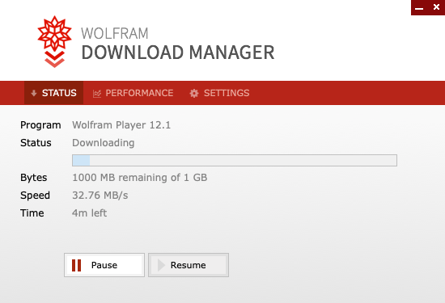
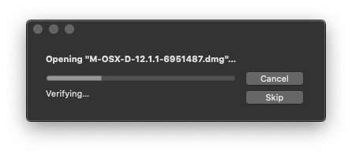

# HCMP Project GUIs
This repository stores the GUIs for HCMP Project.
In the `GUI` folder, there are three Mathematica Notebooks:

- __HCMP_GUI.nb__
- __ParallelProcessing_GUI.nb__
- __2D_Analysis_GUI.nb__

You can simply download and run it. You will find instructions on the usage of the GUIs in `document/instruction.pdf`. 

If you have no access to Wolfram Mathematica, there are three corresponding CDF files as well, which can be opened using the free Wolfram Player. We provide the instruction for downloading and installing Wolfram Player as follows:

### Download and Install Wolfram Player
In order to open the AO-Desktop-App in the main file `AO-App.cdf`, you need to install [Wolfram Player](https://www.wolfram.com/player/) on your computer. [Wolfram Player](https://www.wolfram.com/player/) is a free software developed by [Wolfram Reserch](https://en.wikipedia.org/wiki/Wolfram_Research). The player is available for Microsoft Windows, Macintosh, Linux and iOS, and can be downloaded from the following website:

https://www.wolfram.com/player

Taking **MacOS** for example, after you open the downloaded `WolframPlayer_12.1.1_MAC_DLM` file, you should be able to see

After it is finished, you need to launch the installation package and it will show

When this is done, you can drag the Wolfram Player icon to the Applications folder to complete installation.

## Log

After May 5 2020 meeting, we had made the following changes:
1. Add Number of sample points for the Normal traction component histogram as an extra parameter (May 14, 2020, __HCMP_GUI.nb__).
2. Change the name schemes for image files to either of the following two formats (May 28, 2020, `HCMP.wl`)
    * `Bead1Time1Slice (1)`
    * `ColHCMP_7daySpheroid_TCourse_Particle9Time15Slice (1)`
3. Changed the image file names in the `ExampleData` folder. (May 28,2020)
4. Add parameter palette for user-defined parameters in __ParallelProcessing_GUI.nb__ (Jun 5, 2020)
5. Ignore unrelated files like `thumbs.db` or `.DS_Store` in `Time` folders (Jun 7, 2020)
6. Add __2D_Analysis_GUI.nb__ for processing 2D projection images. (Feb 25, 2021)

## Future plan

After May 5 2020 meeting, we are going add following features to the GUIs:

1. Add computational time approximation (__ParallelProcessing_GUI.nb__)

## HCMP_GUI.nb

__HCMP_GUI.nb__ works on one pair of HCMP configurations. It will plot the point cloud and fitting surface of both one non-deformed HCMP and one deformed HCMP. By using the linear theory of elasticity, the HCMP's stress field is determined through finite element analysis. 
It will plot the traction vectors on the deformed configuration of the HCMP's surface. The normal component of the traction vector (normal traction component) at a large number of HCMP surface points are recorded. The distributions of the normal traction component data will be shown as colormap on the deformed configuration of the HCMP's surface as well as a histogram plot. Radius, volume, average pressures (one third the trace of the stress tensor), elastic energy density and total elastic energy stored within the HCMP
will be calculated.

### how to use HCMP_GUI.nb

You need to click all buttons from top to bottom, from left to right. The directory for both reference and deformed configuration should contain z-stack images of the same HCMP.

## ParallelProcessing_GUI.nb

__ParallelProcessing_GUI.nb__ works for processing massive data set. It performs all image processing and finite element calculations in parallel in one click. In order to use it, you need to put your images in a specific directory structure (please refer to `document/instruction.pdf`).

## 2D_Analysis_GUI.nb

__2D_Analysis_GUI.nb__ works for processing massive 2D Projection image data set. It performs all image processing and 2D calculations in parallel in one click. In order to use it, you need to put your images in similar directory structure as in the above section.

## Contact

For more info on how to use the GUIs or if you need specific features to be added to the GUIs, please email wenqiang_fang@brown.edu
